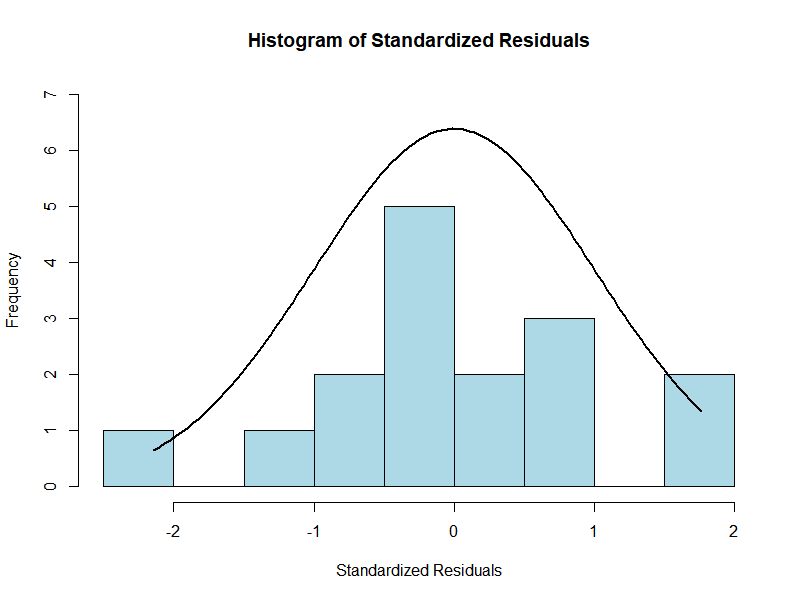
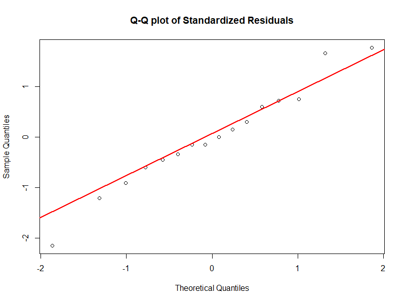
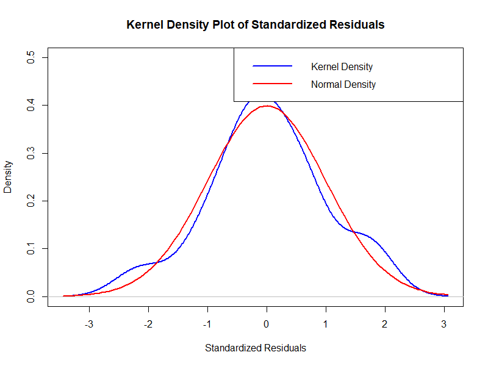
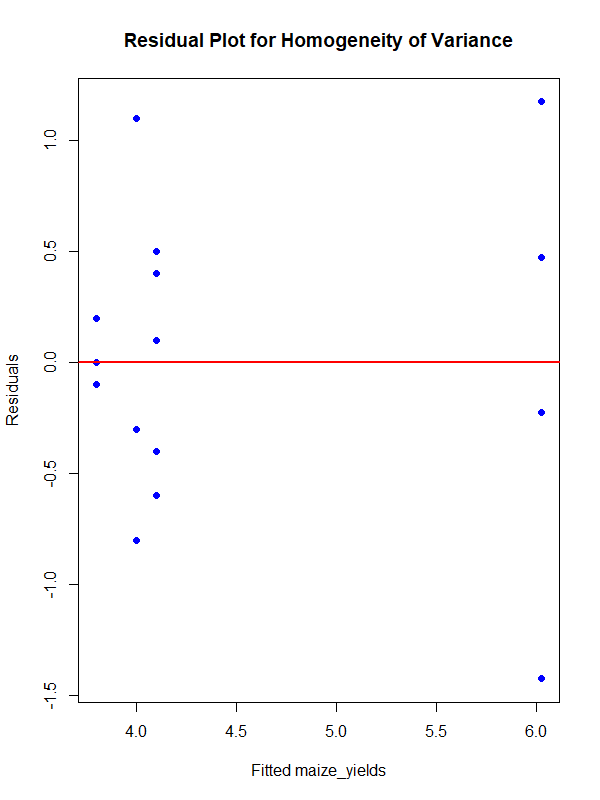

# Evaluating-the-Impact-of-Commercial-Fertilizer-Brands-on-Maize-Yields-Using-One-Way-ANOVA

### Project Objective
To determine the statistical significance of five different commercial fertilizer brands on maize yield in tons. This project features a end-to-end R pipeline that exhaustively tests statistical assumptions like Normality of residuals and Homogeneity of variances before executing the One-Way ANOVA and applying multiple post-hoc correction procedures.

### Tech Stack & Libraries
* **Language:** R
* **Key Libraries:** `nortest` (Lilliefors, Anderson-Darling, Cramer-von Mises), `moments` (D'Agostino),  `agricolae` (LSD Test).

---

### Phase 1: Assumption Testing 

To ensure the integrity of the ANOVA model, the Maize Yield was subjected to assumption testing at a 5% level of significance.

**1. Normality Assessment (Statistical Tests)**
The following tests were executed to verify that the residuals were normally distributed:
* Kolmogorov-Smirnov 
* Shapiro-Wilk
* Lilliefors 
* Anderson-Darling 
* Cramér-von Mises 
* Pearson 
* D'Agostino 

**2. Normality Assessment (Visual Plots)**
*You can view the exported plots in the `/visuals` directory.*
* Histogram of Standardized Residuals
* Quartile-Quartile (Q-Q) Plot
* Kernel Density Plot

**3. Homogeneity of Variance**
To confirm equal variances across the five fertilizer groups, the following tests were conducted:
* Bartlett's Test
* Fligner-Killeen Test
* Residual vs. Fitted Plot

---

### Phase 2: Analysis of Variance (ANOVA)
A One-Way ANOVA was executed to determine if a statistically significant difference exists between the mean yields of the fertilizer brands. 
* **Null Hypothesis:** All fertilizer brands yield the same mean output.
* **Alternative Hypothesis:** At least one fertilizer brand yields a significantly different output.
* *Result:* The null hypothesis was rejected at $p < 0.05$, indicating a statistically significant difference in yield across fertilizer brands.

---

### Phase 3: Post-Hoc Analysis
Following the rejection of the null hypothesis, multiple multiple-comparison procedures were executed to identify the specific pairwise differences between treatments:

1.  Tukey Honestly Significant Difference (HSD)
2.  Least Significant Difference (LSD)

### 💡 Conclusion & Business Impact
Based on the Tukey HSD and LSD Tests, Fertilizer Brand D produced a statistically significant higher yield than Brands A, B, C, D and E. For agricultural stakeholders aiming to maximize tonnage per hectare, Brand D is the recommended fertilizer.

---
*For the complete R syntax, view the `/script` folder.*
### Visuals

